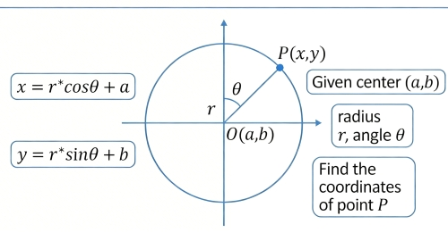

+++
date = '2026-03-21T17:11:28+08:00'
draft = false
title = 'Coordinates on a Circle'
tags = ["calc"]
+++

# Find the coordinates of a point on a circle.

Calculating the coordinates of a point on a circle typically depends on the information you already know (such as the angle, the position of the circle's center, etc.). The most commonly used method involves **trigonometric functions**.



## Standard Circle (Centered at the Origin)

If the center of the circle is located at the origin $(0, 0)$ of the coordinate system, the radius is $r$, and the angle between the point and the positive direction of the $x$-axis is $\theta$, then the coordinates $(x, y)$ of that point are:

$$x = r \cdot \cos(\theta)$$$$y = r \cdot \sin(\theta)$$

## A Circle in a General Position (Center Not at the Origin)

If the coordinates of the circle's center are $(x_c, y_c)$, the radius is $r$, and the angle is $\theta$, then the coordinate calculation formulas must be translated:

$$x = x_c + r \cdot \cos(\theta)$$$$y = y_c + r \cdot \sin(\theta)$$

## Important Considerations and Tips

- **Radian Conversion**：

    In most programming languages ​​(such as C#, C++, and Python), the trigonometric functions cos and sin use radians rather than degrees.
    - Conversion Formula: $\text{Radians} = \text{Degrees} \cdot \frac{\pi}{180}$

- **Coordinate System Orientation**：
    - In a standard mathematical coordinate system, the positive direction of the $y$-axis points upward, and angles increase in a counter-clockwise direction.
    - In computer graphics or screen coordinate systems, the positive direction of the $y$-axis typically points downward. If you find that the rotation direction is reversed, you can try modifying the calculation for $y$ to: $y = y_c - r \cdot \sin(\theta)$.
    - **Circular Motion / Equidistant Points**:
      If you need to calculate $n$ equidistant points on a circle, the angle for the $i$-th point is given by:
      $$\theta_i = \frac{360^\circ}{n} \cdot i$$

## Code Reference (C#/Unity)

```csharp
// Example: Calculate the point at an angle of 45 degrees.
float angleDegrees = 45f;
float radius = 5f;
Vector2 center = new Vector2(10, 10);

float angleRadians = angleDegrees * Mathf.Deg2Rad;
float x = center.x + radius * Mathf.Cos(angleRadians);
float y = center.y + radius * Mathf.Sin(angleRadians);

Vector2 pointOnCircle = new Vector2(x, y);
```
