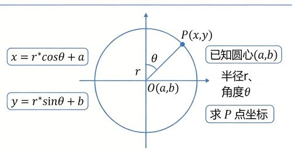

+++
date = '2026-03-21T17:11:28+08:00'
draft = false
title = '圆上坐标'
tags = ["calc"]
+++

# 求圆上一点的坐标

计算圆上一点的坐标，通常取决于你已知的信息（如角度、圆心位置等）。最常用的方法是使用**三角函数**。



## 标准圆 (圆心在原点)

如果圆心位于坐标系原点 $(0, 0)$，半径为 $r$，且该点与 $x$ 轴正方向的夹角为 $\theta$，则该点的坐标 $(x, y)$ 为：

$$x = r \cdot \cos(\theta)$$$$y = r \cdot \sin(\theta)$$

## 一般位置的圆 (圆心不在原点)

如果圆心的坐标为 $(x_c, y_c)$，半径为 $r$，夹角为 $\theta$，则坐标计算公式需要进行平移：

$$x = x_c + r \cdot \cos(\theta)$$$$y = y_c + r \cdot \sin(\theta)$$

## 注意事项与技巧

- **弧度制转换**：

    在大多数编程语言（如 C#、C++、Python）中，三角函数 cos 和 sin 使用的是弧度而非角度。
    - 转换公式：$\text{弧度} = \text{角度} \cdot \frac{\pi}{180}$

- **坐标系方向**：
    - 在数学坐标系中，$y$ 轴向上为正，角度逆时针增加。
    - 在计算机图形学或屏幕坐标系中，$y$ 轴通常向下为正。如果你发现旋转方向反了，可以尝试将 $y$ 的计算改为 $y = y_c - r \cdot \sin(\theta)$。
    - **圆周运动 / 等分点**：
      如果你需要计算圆上的 $n$ 个等分点，第 $i$ 个点的角度为：
      $$\theta_i = \frac{360^\circ}{n} \cdot i$$

## 代码参考(C#/Unity)

```csharp
// 示例：计算角度为 45 度的点
float angleDegrees = 45f;
float radius = 5f;
Vector2 center = new Vector2(10, 10);

float angleRadians = angleDegrees * Mathf.Deg2Rad;
float x = center.x + radius * Mathf.Cos(angleRadians);
float y = center.y + radius * Mathf.Sin(angleRadians);

Vector2 pointOnCircle = new Vector2(x, y);
```
